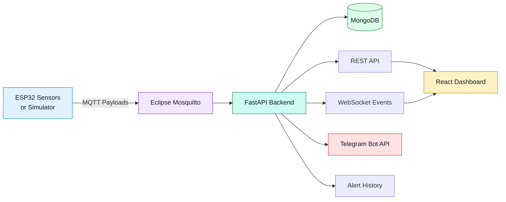
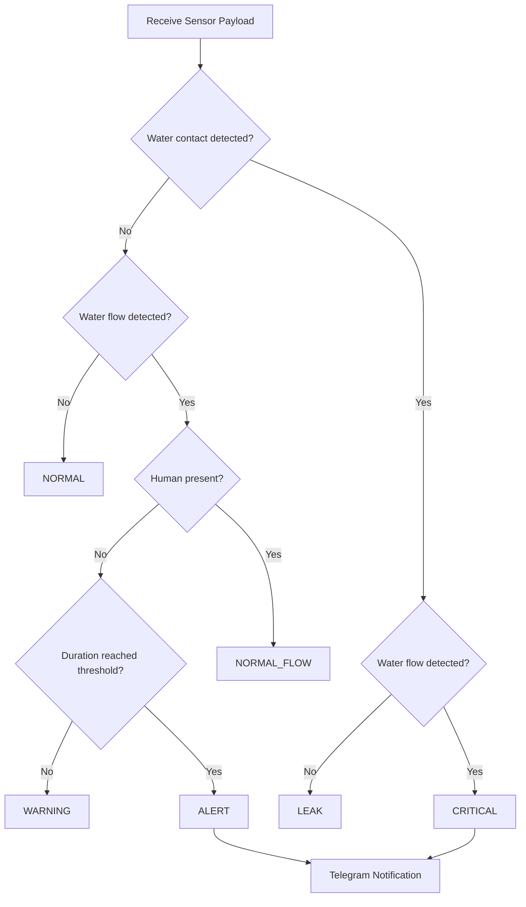

<div align="center">

# 💧 Smart Hydro Alert

### Real-Time IoT Water Waste and Leak Detection Platform

A full-stack IoT prototype for monitoring water usage, detecting unattended flow and local water contact, and presenting system risk through a live dashboard and maintenance notifications.

[](https://github.com/momo840505/smart-hydro-alert)
[](#project-attribution)
[](https://www.python.org/)
[](https://react.dev/)
[](https://fastapi.tiangolo.com/)
[](https://www.mongodb.com/)
[](https://mosquitto.org/)
[](https://www.docker.com/)

[Overview](#overview) ·
[Architecture](#system-architecture) ·
[Detection Logic](#detection-logic) ·
[Dashboard](#dashboard) ·
[Quick Start](#quick-start) ·
[API](#api-reference) ·
[My Contributions](#my-contributions)

</div>

---

## Overview

**Smart Hydro Alert** is an IoT-based monitoring prototype designed for public restrooms and shared washroom environments.

The system receives binary sensor readings from an ESP32 device or the built-in simulator, publishes them through MQTT, stores event data in MongoDB, applies backend decision logic, and presents the latest condition through a React dashboard.

High-risk conditions can trigger Telegram maintenance notifications, while the dashboard displays expected LED and buzzer responses for each system state.

### The Problem

In public facilities, maintenance staff cannot continuously monitor every sink or washroom area.

A forgotten tap, local water contact, standing water, or an overflow condition may continue unnoticed until somebody reports the problem or staff perform a manual inspection.

### The Solution

Smart Hydro Alert combines multiple sensor signals instead of relying on one sensor reading:

- **YF-S201 flow sensor** identifies measurable water flow.
- **LD2410C presence sensor** detects whether a person is near the monitored area.
- **FC-37 water-contact sensor** detects local water near the sink or floor.
- **Duration logic** distinguishes brief unattended flow from a forgotten tap.
- **Combined-sensor validation** reduces false alarms before escalating to a critical state.

---

## Key Features

- 📡 Real-time sensor communication through MQTT
- 🚰 Water-flow monitoring with the YF-S201 sensor
- 🚶 Human-presence detection with the LD2410C sensor
- 💦 Local water-contact detection with the FC-37 sensor
- ⏱️ Duration-based forgotten-tap detection
- 🧠 Combined-sensor validation for critical overflow risk
- 📊 Responsive React monitoring dashboard
- 🗄️ MongoDB storage for device, sensor and alert history
- 🔔 Telegram notifications for `ALERT` and `CRITICAL`
- 💡 LED and buzzer state mapping for local feedback
- 🧪 Six built-in dashboard simulation scenarios
- 💧 Estimated measured water waste based on flow rate and duration
- 🐳 Docker Compose setup for backend infrastructure
- ✅ Unit tests for payload validation, MQTT topics and alert logic

---

## System Architecture



### Data Flow

1. The ESP32 or simulator produces a sensor payload.
2. The payload is published to the Mosquitto MQTT broker.
3. FastAPI validates and classifies the incoming condition.
4. Device state and sensor history are stored in MongoDB.
5. Alert records are created for notification states.
6. The React dashboard retrieves live and historical data through REST endpoints.
7. Telegram messages are sent when notification credentials are configured.

---

## Detection Logic

The backend derives the system state from four main inputs:

```text
water_flow
human_present
water_detected
running_duration_sec
```

### Condition States

| Status | Sensor condition | Interpretation | LED | Buzzer | Telegram |
|---|---|---|---|---|---|
| `NORMAL` | No flow and no water contact | Area is idle and safe | Green | Off | No |
| `NORMAL_FLOW` | Flow detected and human present | Normal sink usage | Blue | Off | No |
| `WARNING` | Flow detected, no human, below threshold | Unattended flow is being monitored | Yellow | Off | No |
| `ALERT` | Flow detected, no human, threshold reached | Possible forgotten tap | Red | Intermittent | Yes |
| `LEAK` | Water contact detected without measurable flow | Local water contact requiring inspection | White | Slow beep | No |
| `CRITICAL` | Flow and water contact detected together | Possible overflow or severe leak | Red flashing | Continuous | Yes |

### Risk Level Mapping

| System state | Risk level | Meaning |
|---|---|---|
| `WARNING` | `LOW` | Suspicious unattended flow below the alert threshold |
| `ALERT` | `MEDIUM` | Possible forgotten tap after the duration threshold |
| `CRITICAL` | `HIGH` | Measurable flow and local water contact detected together |

### Why Combined-Sensor Validation Matters

A single sensor can produce an ambiguous result:

- Water flow alone may represent normal sink use.
- FC-37 water contact alone may be caused by cleaning, splashes or standing water.
- A person may still be using the sink while water is flowing.

For this reason, the highest-risk state is triggered only when measurable water flow and local water contact are detected together:

```text
water_flow = 1
water_detected = 1
        ↓
    CRITICAL
```

This design reduces unnecessary escalation from isolated sensor readings.

---

## Decision Flow



---

## Demo Timing

The standard unattended-flow threshold is configured as:

```text
300 system seconds
```

For classroom demonstration, the backend applies a scaled time rule:

```text
1 real second = 10 system seconds
30 real seconds = 300 system seconds
```

A continuous unattended-flow condition can therefore transition from `WARNING` to `ALERT` in approximately 30 real seconds.

---

## Water Waste Estimation

The YF-S201 sensor provides an estimated flow rate in litres per minute.

```text
Measured water waste (L)
= flow rate (L/min) × duration (seconds) / 60
```

Example:

```text
Flow rate = 0.40 L/min
Duration  = 300 seconds

Measured water waste
= 0.40 × 300 / 60
= 2.00 L
```

The dashboard separates four measurements:

| Dashboard value | Meaning |
|---|---|
| `Flow rate` | Current estimated YF-S201 flow rate |
| `Live measured waste` | Water estimate for the current event |
| `Total measured waste` | Accumulated measurable waste during the displayed session |
| `Leak contact time` | Duration of FC-37-only water contact |

> FC-37 can detect water contact but cannot measure water volume. Therefore, `LEAK` contact is recorded as time rather than an unsupported litre estimate.

---

## Dashboard

The React dashboard provides:

- backend online and offline status
- selected device identification
- current system condition
- human-readable risk explanation
- water-flow sensor value
- human-presence sensor value
- FC-37 water-contact value
- current flow rate
- running duration
- expected LED output
- expected buzzer output
- notification status
- live measured water waste
- accumulated measured water waste
- leak contact time
- device event history
- alert history
- six simulation controls
- reset and clear-demo controls
- raw backend values for technical inspection

### Dashboard Preview

Add your main dashboard screenshot to:

```text
docs/images/dashboard-preview.png
```

Then remove the comment marks from the following line:

<!--

-->

### Simulation Scenarios

| Scenario | Payload summary | Expected state |
|---|---|---|
| Normal | No flow, no person, dry sensor | `NORMAL` |
| Normal Flow | Flow with a person present | `NORMAL_FLOW` |
| Warning | Unattended flow below threshold | `WARNING` |
| Alert | Unattended flow above threshold | `ALERT` |
| Leak | FC-37 contact without measurable flow | `LEAK` |
| Critical | Measurable flow and FC-37 contact | `CRITICAL` |

---

## Hardware Configuration

### Prototype Components

- ESP32 microcontroller
- YF-S201 water-flow sensor
- LD2410C human-presence radar
- FC-37 water-contact sensor
- OLED display
- green LED
- blue LED
- yellow LED
- white LED
- red LED
- buzzer

### LD2410C Demo Configuration

The presence sensor was configured for short-range classroom testing.

| Parameter | Setting | Purpose |
|---|---|---|
| Detection accuracy | `0.2 m` | Improve close-range precision |
| Detection range | `0 m – 0.2 m` | Limit detection to the monitored sink area |
| Unmanned duration | `3 seconds` | Quickly return to no-human state |
| Trigger level | `Low level` | Match the ESP32 input logic |
| Photosensitive linkage | `Disabled` | Avoid light-based triggering |

The range is intentionally limited to reduce false detections from people standing near the prototype.

---

## Technology Stack

### Hardware and Sensors

- ESP32
- YF-S201
- LD2410C
- FC-37
- OLED
- LEDs
- Buzzer

### Backend

- Python 3.11
- FastAPI
- Pydantic
- Beanie ODM
- Motor async MongoDB driver
- aiomqtt
- WebSocket
- HTTPX

### Frontend

- React
- Vite
- JavaScript
- CSS

### Data and Infrastructure

- MongoDB 7
- Eclipse Mosquitto 2
- Docker
- Docker Compose

### Code Quality

- Pytest
- pytest-asyncio
- Ruff
- Black
- ESLint

---

## Project Structure

```text
smart-hydro-alert/
├── app/
│   ├── api/
│   │   ├── alerts.py
│   │   ├── devices.py
│   │   └── websocket.py
│   ├── core/
│   │   └── config.py
│   ├── database/
│   │   ├── collections.py
│   │   └── mongodb.py
│   ├── models/
│   │   ├── alert.py
│   │   ├── device.py
│   │   ├── sensor.py
│   │   └── payloads.py
│   ├── mqtt/
│   │   ├── client.py
│   │   ├── handlers.py
│   │   └── topics.py
│   ├── services/
│   │   ├── alert_service.py
│   │   ├── device_service.py
│   │   ├── notification_service.py
│   │   ├── sensor_service.py
│   │   └── websocket_manager.py
│   └── main.py
│
├── frontend-react/
│   ├── public/
│   ├── src/
│   │   ├── App.jsx
│   │   ├── App.css
│   │   ├── index.css
│   │   └── main.jsx
│   ├── package.json
│   └── vite.config.js
│
├── frontend/
│   └── index.html
│
├── simulator/
│   ├── __main__.py
│   ├── config.py
│   ├── publisher.py
│   └── scenarios.py
│
├── docker/
│   └── mosquitto.conf
│
├── tests/
│   ├── test_alert_logic.py
│   ├── test_payloads.py
│   └── test_topics.py
│
├── docs/
│   └── images/
│
├── .env.example
├── .gitignore
├── .dockerignore
├── docker-compose.yml
├── Dockerfile
├── requirements.txt
├── environment.yml
├── pyproject.toml
└── README.md
```

---

## Quick Start

### Prerequisites

Install:

- Git
- Docker Desktop
- Node.js and npm

### 1. Clone the Repository

```bash
git clone https://github.com/momo840505/smart-hydro-alert.git
cd smart-hydro-alert
```

### 2. Create the Environment File

#### macOS or Linux

```bash
cp .env.example .env
```

#### Windows PowerShell

```powershell
Copy-Item .env.example .env
```

Telegram credentials are optional.

```env
TELEGRAM_BOT_TOKEN=
TELEGRAM_CHAT_ID=
```

> Never commit your real `.env` file or notification credentials.

### 3. Start the Backend Infrastructure

```bash
docker compose up -d --build mongo mosquitto backend
```

Check container status:

```bash
docker compose ps
```

Available services:

| Service | URL or port |
|---|---|
| FastAPI backend | `http://localhost:8000` |
| Swagger API documentation | `http://localhost:8000/docs` |
| Health endpoint | `http://localhost:8000/health` |
| MongoDB | `localhost:27017` |
| MQTT broker | `localhost:1883` |

### 4. Start the React Dashboard

Open a second terminal:

```bash
cd frontend-react
npm install
npm run dev
```

Open:

```text
http://localhost:5173
```

### Docker Frontend Option

Build the React application first:

```bash
cd frontend-react
npm install
npm run build
cd ..
```

Then start the frontend container:

```bash
docker compose up -d frontend
```

Open:

```text
http://localhost:3000
```

---

## Using the Dashboard Demo

1. Open `http://localhost:5173`.
2. Confirm that **Backend Online** is displayed.
3. Select `device01`.
4. Click **Clear Demo**.
5. Run the scenarios in this order:

```text
NORMAL
   ↓
NORMAL_FLOW
   ↓
WARNING
   ↓
ALERT
   ↓
LEAK
   ↓
CRITICAL
```

Observe changes in:

- system status
- risk level
- flow rate
- running duration
- LED output
- buzzer output
- measured water waste
- leak contact time
- device history
- alert history
- notification status

---

## Sensor Payload

The system uses binary `0/1` values for sensor states.

| Field | `0` | `1` |
|---|---|---|
| `water_flow` | No measurable flow | Flow detected |
| `human_present` | No person detected | Person detected |
| `water_detected` | FC-37 is dry | Water contact detected |
| `alert` | No remote alert | Remote alert required |

Example MQTT sensor payload:

```json
{
  "device_id": "device01",
  "timestamp": 1778926532,
  "water_flow": 1,
  "human_present": 0,
  "water_detected": 1,
  "alert": 1,
  "status": "CRITICAL",
  "running_duration_sec": 0,
  "flow_rate_lpm": 0.4
}
```

---

## MQTT Topics

The backend subscribes to:

```text
home/+/+/sensor
home/+/+/alert
home/+/+/status
```

Examples:

```text
home/bathroom/device01/sensor
home/bathroom/device01/alert
home/bathroom/device01/status
```

---

## API Reference

| Method | Endpoint | Purpose |
|---|---|---|
| `GET` | `/health` | Check backend health |
| `GET` | `/api/devices` | List devices and current states |
| `POST` | `/api/devices/register` | Register or update a device |
| `GET` | `/api/devices/{device_id}/live` | Return the latest device state |
| `GET` | `/api/devices/{device_id}/history` | Return sensor history |
| `POST` | `/api/devices/{device_id}/simulate` | Submit a simulation payload |
| `POST` | `/api/devices/{device_id}/reset?clear_logs=0` | Reset the device to normal |
| `POST` | `/api/devices/{device_id}/reset?clear_logs=1` | Reset and remove demo logs |
| `GET` | `/api/alerts` | Return alert history |
| `WS` | `/ws/devices/{device_id}` | Receive real-time device events |

Interactive API documentation:

```text
http://localhost:8000/docs
```

---

## Testing and Code Quality

### Create a Virtual Environment

```bash
python -m venv .venv
```

#### Activate on macOS or Linux

```bash
source .venv/bin/activate
```

#### Activate on Windows PowerShell

```powershell
.venv\Scripts\Activate.ps1
```

### Install Dependencies

```bash
pip install -r requirements.txt
```

### Run Backend Tests

```bash
pytest -q
```

### Run Python Lint Checks

```bash
ruff check app tests
```

### Check Python Formatting

```bash
black --check app tests
```

### Run Frontend Linting

```bash
cd frontend-react
npm run lint
```

---

## Telegram Notifications

Telegram notifications are generated for:

```text
ALERT
CRITICAL
```

### ALERT Example

```text
🚨 Smart Hydro Alert

Device: device01
Status: ALERT
Risk Level: MEDIUM
Duration: 300s

Reason:
Water flow continued without nearby human presence until the alert threshold was reached.

Action:
Please check whether the tap has been left running.
```

### CRITICAL Example

```text
🚨 Smart Hydro Alert

Device: device01
Status: CRITICAL
Risk Level: HIGH
Duration: Immediate trigger

Reason:
Measurable water flow and FC-37 water contact were detected at the same time.

Action:
Please inspect the sink, tap, and nearby floor area immediately.
```

---

## Useful Docker Commands

### View Running Services

```bash
docker compose ps
```

### Follow Backend Logs

```bash
docker compose logs -f backend
```

### Follow MQTT Broker Logs

```bash
docker compose logs -f mosquitto
```

### Restart the Backend

```bash
docker compose restart backend
```

### Stop the Application

```bash
docker compose down
```

### Stop and Remove Persistent Volumes

```bash
docker compose down -v
```

---

## Real Hardware Evidence

The dashboard simulator demonstrates the complete backend and frontend workflow.

A separate hardware demonstration can show:

- ESP32 powered on
- YF-S201 connected to running water
- FC-37 detecting water contact
- LD2410C detecting nearby human presence
- OLED status output
- LED state changes
- buzzer behaviour
- MQTT payloads in the Serial Monitor
- dashboard responses
- Telegram notifications for high-risk states

The simulator uses the same sensor payload structure and backend decision logic as the physical prototype.

---

## My Contributions

This project was developed as a university team project.

My work focused on the monitoring dashboard, sensor-state logic, simulation workflow, testing and technical documentation.

### Main Contributions

- designed and implemented the React monitoring dashboard
- improved dashboard layout, responsiveness and state visualisation
- added complete binary `0/1` sensor handling
- implemented six user-facing monitoring states
- refined combined-sensor validation for `LEAK` and `CRITICAL`
- improved measured-water-waste calculations and presentation
- added leak-contact-time tracking
- refined alert-risk mapping
- improved Telegram notification behaviour
- created repeatable classroom simulation scenarios
- added and updated validation and alert-logic tests
- expanded technical and demonstration documentation

### Relevant Commits

- [`debef3f`](https://github.com/hnguyen-debug/IoT-group4/commit/debef3fd576c04bd4365e5d547bb6f71ef7b2250) — Add full 0/1 sensor logic and demo dashboard
- [`97875cd`](https://github.com/hnguyen-debug/IoT-group4/commit/97875cd) — Update README and frontend base styles
- [`5711e8b`](https://github.com/hnguyen-debug/IoT-group4/commit/5711e8b) — Improve dashboard layout and demo workflow
- [`446f722`](https://github.com/hnguyen-debug/IoT-group4/commit/446f7220bdb6dd206397e96511a7aefd0024a42e) — Refine waste estimates and demo documentation
- [`989cbcc`](https://github.com/hnguyen-debug/IoT-group4/commit/989cbcc148b8a6dac876341a81eac239347a6df0) — Refine alert logic with combined sensor validation

---

## Limitations

This repository is an academic prototype rather than a production water-management system.

Current limitations include:

- rule-based thresholds rather than learned anomaly detection
- limited calibration under controlled prototype conditions
- no automatic water shut-off valve
- no authentication or role-based access control
- local deployment rather than managed cloud infrastructure
- one primary demonstration device
- estimated flow values depend on sensor calibration
- no long-term field study across multiple facilities
- no automated maintenance-ticket workflow
- no formal reliability or safety certification

---

## Future Improvements

Planned extensions include:

- cloud deployment for remote facility monitoring
- configurable thresholds for different locations
- multi-device and multi-building management
- historical water-usage analytics
- automated solenoid-valve shut-off
- flow-sensor calibration tools
- mobile-friendly maintenance workflows
- role-based access for facility managers and technicians
- alert acknowledgement and incident resolution tracking
- anomaly-detection models after sufficient sensor data is collected
- sensor and model drift monitoring
- predictive maintenance for sensor failures

---

## Project Attribution

This repository is a portfolio fork of the original university team project.

- **Portfolio repository:** [momo840505/smart-hydro-alert](https://github.com/momo840505/smart-hydro-alert)
- **Original team repository:** [hnguyen-debug/IoT-group4](https://github.com/hnguyen-debug/IoT-group4)

The repository preserves the original Git history so that team and individual contributions remain transparent.

---

<div align="center">

### Built to explore how real-time IoT data can support earlier detection of water waste and leak risk.

⭐ If you find this project useful, consider starring the repository.

</div>
