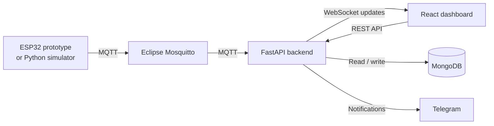
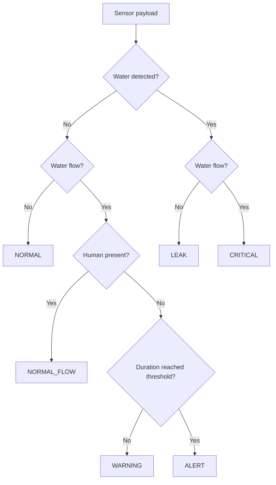

<div align="center">

# 💧 Smart Hydro Alert

An IoT water monitoring prototype built with MQTT, FastAPI, MongoDB and React.

[](https://smart-hydro-alert.onrender.com)
[](https://www.python.org/)
[](https://mosquitto.org/)
[](https://react.dev/)

</div>

## About

Smart Hydro Alert started as a university team project.

The original prototype used an ESP32 with a YF-S201 flow sensor, an LD2410C presence sensor and an FC-37 water-contact sensor.

After the university project, I continued working on the software side and added a FastAPI backend, MongoDB storage, a React dashboard, a Python simulator, automated tests and deployment support.

The current project includes:

* MQTT sensor messaging
* FastAPI backend
* MongoDB event storage
* WebSocket dashboard updates
* React dashboard
* Telegram alerts
* Python MQTT simulator
* device connection monitoring
* Docker Compose
* backend and frontend checks in GitHub Actions

The original ESP32 hardware is not required for the current software demo.

---

## System Flow


```mermaid
flowchart LR
    A[ESP32 prototype<br/>or Python simulator]
    B[Eclipse Mosquitto]
    C[FastAPI backend]
    D[(MongoDB)]
    E[React dashboard]
    F[Telegram]

    A -->|MQTT| B
    B -->|MQTT| C

    E -->|REST API| C
    C -->|WebSocket updates| E

    C -->|Read / write| D
    C -->|Notifications| F
```

The original ESP32 prototype and the Python simulator send data through MQTT.

The hosted dashboard can also send demo sensor values directly to the FastAPI backend through REST, so the software can be tested without the original hardware.

---

## Detection States

The backend calculates the current state from:

```text
water_flow
human_present
water_detected
running_duration_sec
```

| State         | Condition                                      | Meaning                   |
| ------------- | ---------------------------------------------- | ------------------------- |
| `NORMAL`      | No flow and no water contact                   | Idle                      |
| `NORMAL_FLOW` | Flow with a person present                     | Normal water use          |
| `WARNING`     | Flow with no person below the time threshold   | Unattended flow           |
| `ALERT`       | Flow with no person reaches the time threshold | Possible forgotten tap    |
| `LEAK`        | Water contact without measurable flow          | Local water contact       |
| `CRITICAL`    | Flow and water contact together                | Possible leak or overflow |

Telegram notifications are created for:

```text
ALERT
CRITICAL
```

---

## Decision Logic


```mermaid
flowchart TD
    A[Sensor payload] --> B{Water detected?}

    B -- No --> C{Water flow?}
    B -- Yes --> D{Water flow?}

    C -- No --> E[NORMAL]
    C -- Yes --> F{Human present?}

    F -- Yes --> G[NORMAL_FLOW]
    F -- No --> H{Duration reached threshold?}

    H -- No --> I[WARNING]
    H -- Yes --> J[ALERT]

    D -- No --> K[LEAK]
    D -- Yes --> L[CRITICAL]
```

Using more than one sensor input helps separate normal water use from unattended flow and local water contact.

---

## Demo Timing

The default unattended-flow threshold is:

```text
300 system seconds
```

For the demo, the backend uses a 10× time scale:

```text
1 real second = 10 system seconds
```

This means continuous unattended flow can reach the alert threshold in about 30 real seconds.

---

## Water Estimate

For events with measurable flow:

```text
water (L) = flow rate (L/min) × duration (sec) / 60
```

Example:

```text
0.4 L/min × 300 sec / 60
= 2.0 L
```

The FC-37 sensor only detects water contact. It does not measure flow rate.

Because of this, `LEAK` events are recorded as contact time instead of litres.

---

## Dashboard Demo

The React dashboard has six test states:

```text
NORMAL
NORMAL_FLOW
WARNING
ALERT
LEAK
CRITICAL
```

The dashboard sends these demo payloads through:

```text
POST /api/devices/{device_id}/simulate
```

The backend calculates the final state again from the sensor values.

The separate Python MQTT simulator currently covers:

* normal use
* intermittent use
* unattended flow
* multiple simulated devices

The MQTT simulator does not yet have a separate scenario for every dashboard state.

---

## Device Connection Monitoring

A device is marked online when sensor or status data is received.

The backend also checks the device `last_seen` timestamp.

If an online device has not sent data for longer than the configured timeout, it is changed to:

```text
OFFLINE
```

Default settings:

```env
DEVICE_OFFLINE_AFTER_SEC=60
DEVICE_STATUS_CHECK_INTERVAL_SEC=10
```

The backend checks device connection status every 10 seconds by default.

---

## MQTT Topics

The backend subscribes to:

```text
home/+/+/sensor
home/+/+/alert
home/+/+/status
```

Examples:

```text
home/bathroom/device01/sensor
home/bathroom/device01/alert
home/bathroom/device01/status
```

Example sensor payload:

```json
{
  "device_id": "device01",
  "timestamp": 1778926532,
  "water_flow": 1,
  "human_present": 0,
  "water_detected": 1,
  "alert": 1,
  "running_duration_sec": 0,
  "flow_rate_lpm": 0.4
}
```

---

## Tech Stack

### Original Hardware

* ESP32
* YF-S201 flow sensor
* LD2410C presence sensor
* FC-37 water-contact sensor
* OLED
* LEDs
* buzzer

### Backend

* Python 3.11
* FastAPI
* Pydantic
* Beanie
* Motor
* MongoDB
* aiomqtt
* WebSocket
* HTTPX

### Frontend

* React
* Vite
* JavaScript
* CSS

### Tools

* Docker
* Docker Compose
* Eclipse Mosquitto
* Pytest
* Ruff
* Black
* ESLint
* GitHub Actions

---

## Project Structure

```text
smart-hydro-alert/
├── app/
│   ├── api/
│   ├── core/
│   ├── database/
│   ├── models/
│   ├── mqtt/
│   ├── services/
│   └── main.py
│
├── frontend-react/
│   ├── public/
│   └── src/
│
├── simulator/
├── tests/
├── docs/
├── docker/
│
├── .env.example
├── docker-compose.yml
├── Dockerfile
├── requirements.txt
├── render.yaml
└── README.md
```

---

## Run Locally

### 1. Clone the repository

```bash
git clone https://github.com/momo840505/smart-hydro-alert.git
cd smart-hydro-alert
```

### 2. Create the environment file

Windows PowerShell:

```powershell
Copy-Item .env.example .env
```

macOS or Linux:

```bash
cp .env.example .env
```

Telegram credentials are optional for local development.

### 3. Start the backend services

```bash
docker compose up -d --build mongo mosquitto backend
```

Backend:

```text
http://localhost:8000
```

API documentation:

```text
http://localhost:8000/docs
```

### 4. Start the dashboard

```bash
cd frontend-react
npm install
npm run dev
```

Open:

```text
http://localhost:5173
```

---

## Backend Checks

Create a virtual environment:

```bash
python -m venv .venv
```

Activate it on Windows:

```powershell
.\.venv\Scripts\Activate.ps1
```

Install the dependencies:

```bash
pip install -r requirements.txt
```

Run the tests:

```bash
pytest
```

Run Ruff:

```bash
ruff check .
```

Check Black formatting:

```bash
black --check .
```

The current backend test suite contains 59 tests covering:

* sensor-state rules
* payload validation
* API-key behaviour
* MQTT topic handling
* device offline detection

---

## Frontend Checks

From `frontend-react`:

```bash
npm ci
npm run lint
npm run build
```

---

## Main API Routes

| Method | Endpoint                     | Purpose               |
| ------ | ---------------------------- | --------------------- |
| `GET`  | `/health`                    | Backend health        |
| `GET`  | `/api/devices`               | List devices          |
| `GET`  | `/api/devices/{id}/live`     | Latest device state   |
| `GET`  | `/api/devices/{id}/history`  | Sensor history        |
| `POST` | `/api/devices/{id}/simulate` | Send a demo payload   |
| `POST` | `/api/devices/{id}/reset`    | Reset the demo device |
| `GET`  | `/api/alerts`                | Alert history         |
| `WS`   | `/ws/devices/{id}`           | Live device updates   |

State-changing endpoints use the shared `X-API-Key` check outside local development.

---

## Limitations

This project is a prototype rather than a production water-safety system.

Current limitations include:

* the original ESP32 hardware is not part of the hosted demo
* thresholds are rule-based
* flow readings require hardware calibration
* the hosted dashboard uses a shared demo key instead of individual user accounts
* the local Mosquitto setup does not currently use authentication or TLS
* there is no automatic shut-off valve
* there has not been a long-term field test across several facilities
* the MQTT simulator does not yet cover all six dashboard states

Areas I would like to continue exploring include MQTT security, virtual IoT device testing and industrial protocols such as Modbus.

---

## My Contribution

This project was developed as a university team project.

My work focused mainly on the monitoring logic, dashboard, simulation workflow, testing and project documentation.

---

## Attribution

Original university team repository:

[hnguyen-debug/IoT-group4](https://github.com/hnguyen-debug/IoT-group4)

This repository keeps the original project history so the team work and later changes can still be distinguished.
