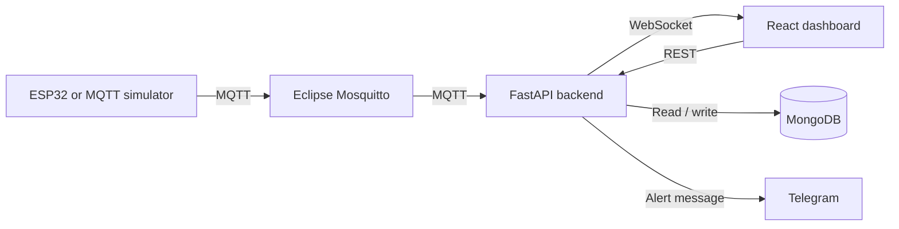
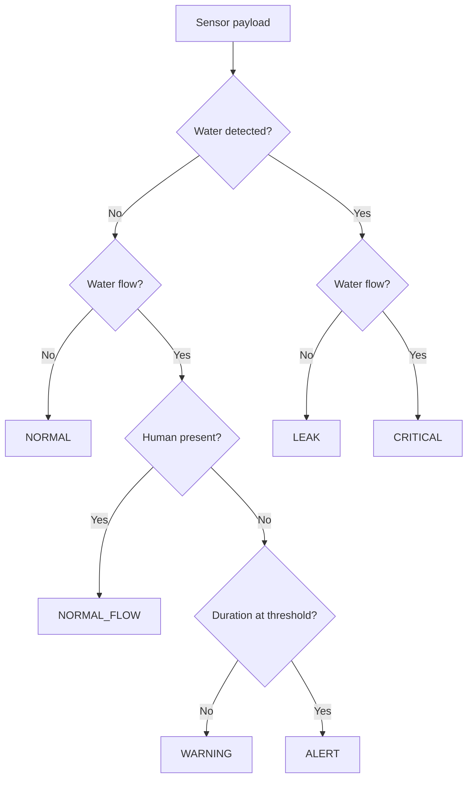

<div align="center">

# Smart Hydro Alert

An IoT water-monitoring prototype using MQTT, FastAPI, MongoDB, and React.

[](https://smart-hydro-alert.onrender.com)
[](https://www.python.org/)
[](https://mosquitto.org/)
[](https://react.dev/)

</div>

## Background

Smart Hydro Alert started as a university team project.

The original prototype used an ESP32 with a YF-S201 flow sensor, an LD2410C presence sensor, and an FC-37 water-contact sensor.

After the class project I kept working on the software side. I added the FastAPI backend, MongoDB storage, React dashboard, Python simulator, tests, deployment setup, API-key checks, WebSocket updates, and device offline detection.

The hosted demo does not need the original ESP32 hardware.

## System flow


```mermaid
flowchart LR
    A[ESP32 or MQTT simulator]
    B[Eclipse Mosquitto]
    C[FastAPI backend]
    D[(MongoDB)]
    E[React dashboard]
    F[Telegram]

    A -->|MQTT| B
    B -->|MQTT| C
    E -->|REST| C
    C -->|WebSocket| E
    C -->|Read / write| D
    C -->|Alert message| F
```

The dashboard also has a REST demo route so I can trigger sensor states without the physical device.

## Sensor states

The backend calculates the state from:

```text
water_flow
human_present
water_detected
running_duration_sec
```

| State | Condition | Meaning |
|---|---|---|
| `NORMAL` | no flow and no water contact | idle |
| `NORMAL_FLOW` | flow with a person present | normal water use |
| `WARNING` | unattended flow below the time threshold | possible forgotten tap, not alerting yet |
| `ALERT` | unattended flow reaches the time threshold | possible forgotten tap |
| `LEAK` | water contact without measurable flow | local water contact |
| `CRITICAL` | water flow and water contact together | possible leak or overflow |

Telegram notifications are only created for:

```text
ALERT
CRITICAL
```

## Decision logic


```mermaid
flowchart TD
    A[Sensor payload] --> B{Water detected?}
    B -- No --> C{Water flow?}
    B -- Yes --> D{Water flow?}

    C -- No --> E[NORMAL]
    C -- Yes --> F{Human present?}
    F -- Yes --> G[NORMAL_FLOW]
    F -- No --> H{Duration at threshold?}
    H -- No --> I[WARNING]
    H -- Yes --> J[ALERT]

    D -- No --> K[LEAK]
    D -- Yes --> L[CRITICAL]
```

Using more than one sensor input helps separate normal water use from unattended flow and local water contact.

## Demo timing

The unattended-flow threshold is 300 seconds by default.

Real MQTT/device messages always use normal 1× elapsed time.

Only the REST demo route can use a faster clock. The default demo setting is:

```env
DEMO_TIME_SCALE=10
```

So when the dashboard sends repeated unattended-flow demo values, 30 real seconds can represent 300 demo seconds.

This multiplier is passed only by:

```text
POST /api/devices/{device_id}/simulate
```

It is not applied to MQTT sensor traffic from an ESP32 or the Python MQTT simulator.

## Water estimate

For events with a measured flow rate:

```text
water (L) = flow rate (L/min) × duration (sec) / 60
```

Example:

```text
0.4 L/min × 300 sec / 60 = 2.0 L
```

The FC-37 only reports water contact. It does not measure a flow rate, so `LEAK` events are treated as contact events rather than estimated litres.

## Dashboard demo

The React dashboard can send six test states:

```text
NORMAL
NORMAL_FLOW
WARNING
ALERT
LEAK
CRITICAL
```

The frontend does not get to choose the final state directly. It sends sensor values, and the backend calculates the state again.

The separate MQTT simulator currently covers:

- normal use;
- intermittent use;
- unattended flow;
- multiple simulated devices.

It does not yet have a separate named scenario for every dashboard state.

## Device connection monitoring

A device is marked online when sensor or status data arrives.

The backend checks `last_seen` and changes stale online devices to `OFFLINE`.

Default values:

```env
DEVICE_OFFLINE_AFTER_SEC=60
DEVICE_STATUS_CHECK_INTERVAL_SEC=10
```

## MQTT topics

The backend subscribes to:

```text
home/+/+/sensor
home/+/+/alert
home/+/+/status
```

Examples:

```text
home/bathroom/device01/sensor
home/bathroom/device01/alert
home/bathroom/device01/status
```

Example sensor payload:

```json
{
  "device_id": "device01",
  "timestamp": 1778926532,
  "water_flow": 1,
  "human_present": 0,
  "water_detected": 1,
  "alert": 1,
  "running_duration_sec": 0,
  "flow_rate_lpm": 0.4
}
```

The backend checks payload size, schema, topic/device ID agreement, and timestamp skew before processing MQTT messages.

## Main API routes

| Method | Endpoint | Purpose |
|---|---|---|
| `GET` | `/health` | backend health |
| `GET` | `/api/devices` | list devices |
| `GET` | `/api/devices/{id}/live` | latest device state |
| `GET` | `/api/devices/{id}/history` | sensor history |
| `POST` | `/api/devices/{id}/simulate` | send demo sensor values |
| `POST` | `/api/devices/{id}/reset` | reset demo device |
| `GET` | `/api/alerts` | alert history |
| `WS` | `/ws/devices/{id}` | live updates |

State-changing routes use a shared `X-API-Key` outside local development.

## Run locally

### 1. Create `.env`

PowerShell:

```powershell
Copy-Item .env.example .env
```

Telegram settings are optional for local development.

### 2. Start backend services

```bash
docker compose up -d --build mongo mosquitto backend
```

Backend:

```text
http://localhost:8000
```

API docs:

```text
http://localhost:8000/docs
```

### 3. Start the React dashboard

```bash
cd frontend-react
npm install
npm run dev
```

Open:

```text
http://localhost:5173
```

## Checks

Backend:

```bash
python -m venv .venv
pip install -r requirements.txt
pytest
ruff check .
black --check .
```

Frontend:

```bash
cd frontend-react
npm ci
npm run lint
npm run build
```

The backend tests cover sensor-state rules, payload validation, API-key behaviour, MQTT topic handling, device offline detection, and the difference between real-time and accelerated demo timing.

GitHub Actions runs backend tests/lint/format checks and the frontend lint/build.

## Project layout

```text
smart-hydro-alert/
├── app/
│   ├── api/
│   ├── core/
│   ├── database/
│   ├── models/
│   ├── mqtt/
│   ├── services/
│   └── main.py
├── frontend-react/
├── simulator/
├── tests/
├── docs/
├── docker/
├── .env.example
├── docker-compose.yml
├── Dockerfile
├── requirements.txt
├── render.yaml
└── README.md
```

## Tools used

### Original hardware

- ESP32
- YF-S201 flow sensor
- LD2410C presence sensor
- FC-37 water-contact sensor
- OLED, LEDs, buzzer

### Software

- Python 3.11
- FastAPI
- Pydantic
- Beanie / Motor
- MongoDB
- aiomqtt
- Eclipse Mosquitto
- WebSocket
- React / Vite
- Docker / Docker Compose
- pytest, Ruff, Black, ESLint
- GitHub Actions

## Current limitations

This is a prototype, not a production water-safety system.

- The physical ESP32 is not part of the hosted demo.
- Alert thresholds are rules rather than learned behaviour.
- Real flow sensors need calibration on the actual installation.
- The hosted dashboard uses one shared demo key instead of user accounts.
- The local Mosquitto configuration does not use TLS or authentication yet.
- There is no automatic shut-off valve.
- I have not run a long-term field test across multiple sites.
- The MQTT simulator does not have a named scenario for all six dashboard states.

The next IoT areas I would like to add are MQTT security and an industrial-protocol exercise using Modbus or OPC UA.

## My contribution

This started as a university team project.

My later work focused mainly on the monitoring logic, backend integration, dashboard, simulation workflow, testing, security checks, and project documentation.

## Attribution

Original university team repository:

[hnguyen-debug/IoT-group4](https://github.com/hnguyen-debug/IoT-group4)

I kept the original history so the team work and my later changes can still be distinguished.
